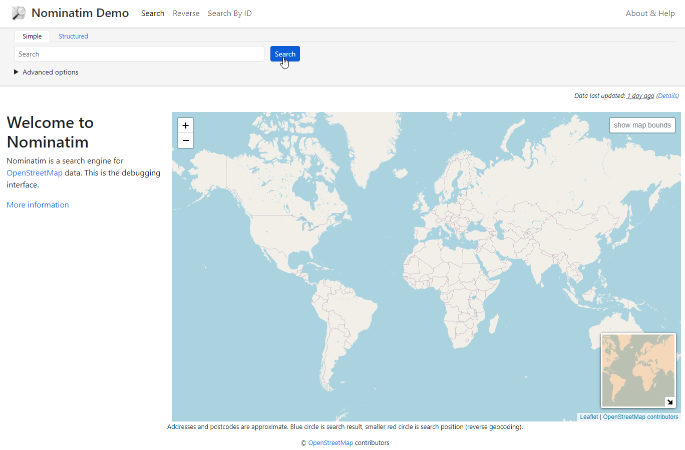
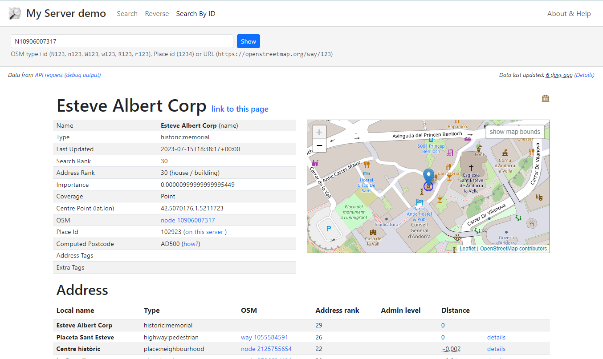

Installation and Usage
===========================
This script is for building a basic Nominatim server with OpenStreetMap data.

Only for use on a clean Ubuntu 22!

Running the Script
------------------

Step 1: Get the OpenNameSearch.sh script from GitHub::

	wget https://raw.githubusercontent.com/AcuGIS/OpenNameSearch/master/OpenNameSearch.sh

Step 2: Make it executable::

	chmod 755 OpenNameSearch.sh

Step 3: Run the script::

	./OpenNameSearch pbf_url

Examples
------------

Load Andorra data (one of the smallest data sets)::

	./OpenNameSearch.sh https://download.geofabrik.de/europe/andorra-latest.osm.pbf

Welcome Page
------------

Once installation completes, navigate to the IP or hostname on your server.

You should see a page as below:

Click the Search function (or go to domain.com/search.html)

You should see a page as below:

To test functionality, enter below into the Search box::

	AD500 Andorra la Vella, Andorra

Confirm that results are returned
	

Loading and Reloading PBFs
--------------------------

You can use our reload-OpenNameSearch.sh script via GitHUB script.

Usage is::

	./reload-OpenNameSearch.sh [PBF_URL1] [PBF_URL2] ...

Enable Automatic Updates
------------------------

The script creates an updater service.  In order to enable updates::

	chmod +x /etc/init.d/nominatim_updater

Credits
-------

https://www.acugis.com

https://citedcorp.com

Contribute
----------

- Issue Tracker: github.com/AcuGIS/OpenNameSearch/issues
- Source Code: github.com/AcuGIS/OpenNameSearch

Support
-------

If you are having issues, please let us know.

License
-------

The project is licensed under the BSD license.
